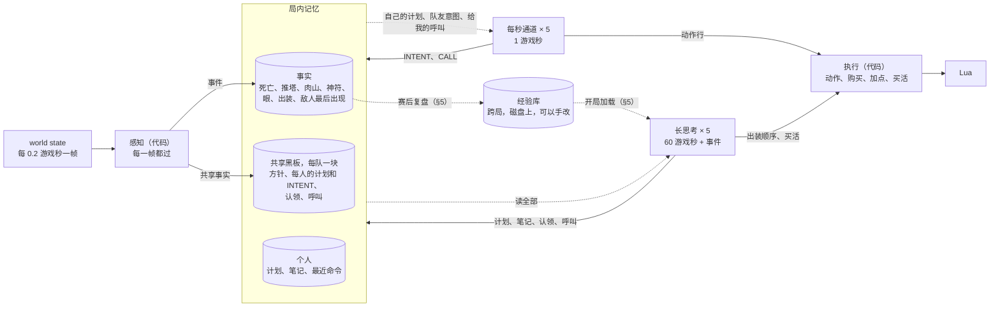
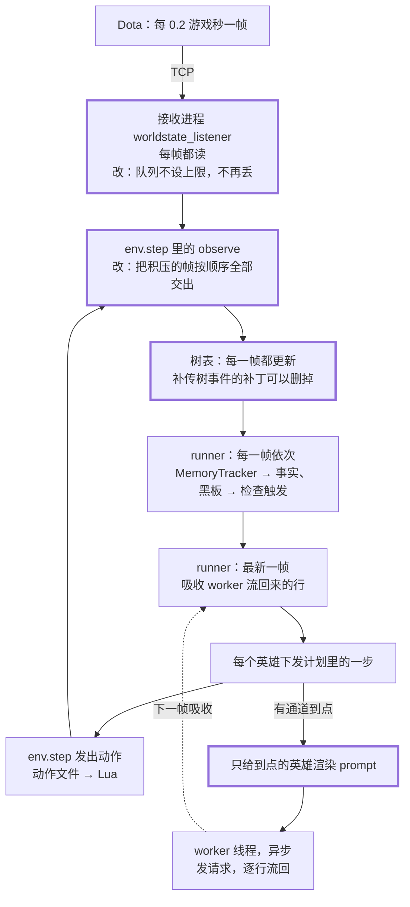
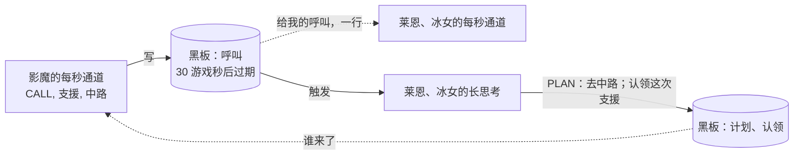
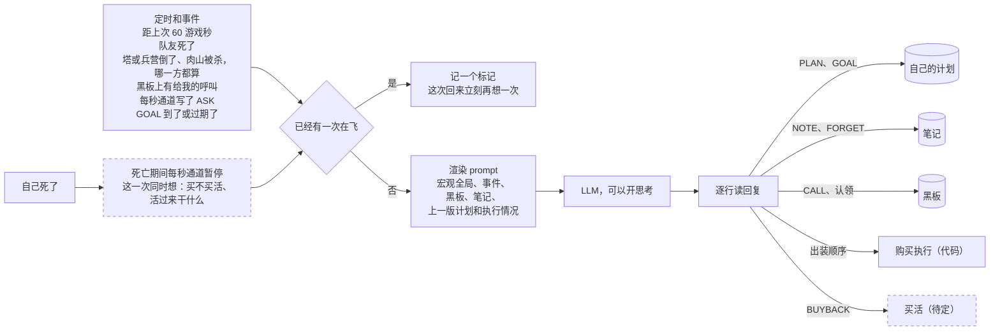
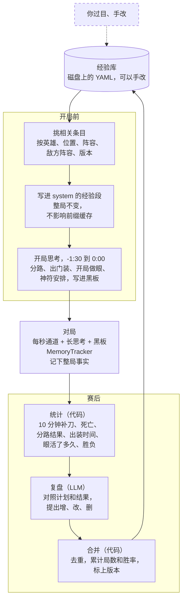

# LLM agent 设计草案：分层思考、记忆和共享黑板

这是草案，用来讨论和改，还没有对应的代码。图都是 Mermaid，改代码块里的文字就行，GitHub 和 VS Code 的
Markdown 预览都能直接渲染。

图例：实线箭头是写或发出，虚线箭头是读或流回；粗框是要改的现有代码，虚线框是还没定的。

## 1. 总体



| 层 | 节奏 | 读 | 写 | 模型 |
|---|---|---|---|---|
| 感知 | 每帧，一帧都不漏 | world state | 事实，黑板上的共享事实 | 代码 |
| 每秒通道 | `decision_interval`，默认 1 游戏秒 | 局部状态、自己的计划和 INTENT、队友意图、给我的呼叫 | 动作、INTENT、CALL | 快，关思考 |
| 长思考 | 60 游戏秒 + 事件（§4） | 全部 | 计划、笔记、黑板、出装顺序、买活 | 可以开思考 |
| 开局思考 | 号角前一次 | 经验库、双方阵容 | 分路、出门装、开局做眼 | 同长思考 |
| 赛后复盘 | 赛后一次 | 整局事实、统计、每个人的计划 | 经验库（候选条目） | 可以用最强的，不赶时间 |

每秒通道不读事实和笔记的原文，只读长思考写下的计划和黑板上跟它有关的几行：长思考把记忆压缩成几行指令，
每秒的 prompt 只多一百来个 token。

## 2. 每帧主循环：感知不丢帧，控制用最新帧，思考异步



- "一个线程正常接收 world state"现在已经有了：`worldstate_listener` 是单独的进程，每帧都读；LLM 请求也已经在
  worker 线程里异步跑。丢帧发生在它后面两处，两处都只把被丢那几帧的树事件接到下一帧：
  1. listener 的队列里攒了 2 帧还没被取走，新来的帧就丢（`dota2_env/bridge/worldstate.py:91`）；
  2. `observe()` 落后时直接跳到最新一帧（`dota2_env/bridge/session.py:89`），计进 `skipped_observations`。
- 改法是"感知不丢、控制取最新"：两处都不再丢帧，`observe()` 把积压的帧按顺序全部交出（比如放进
  `info['world_states']`），每一帧都过树表和 MemoryTracker，控制只用最新那一帧。树表也就不再需要补传树事件。
- 不单开一个感知线程：主线程是记忆和黑板唯一的写者，渲染 prompt 时读到的是一致的快照，不用加锁（`Slot`
  现在就是这个约定）。积压的帧只会让一个事件晚几十毫秒被发现，比起 LLM 的延迟可以忽略。
- 主循环要在一帧之内跑完，timescale 4 下是 50 毫秒。现在只要有一个英雄到点，`decide()` 就渲染全部 5 个英雄的
  状态块（`dota2_env/llm/runner.py:195`），要改成只渲染到点的那几个。
- 这会改 `DotaSession` 的接口：`tests/fake_session.py` 和 `docs/MAP_DATA.md` §5 要一起改。

## 3. 共享黑板

每队一块，由主线程写、在渲染 prompt 时读。

| 栏目 | 谁写 | 谁读 | 什么时候失效 |
|---|---|---|---|
| 队伍方针 | 长思考（以后也可以是队长） | 所有长思考 | 下一次改写 |
| 每人的 PLAN、GOAL | 各自的长思考 | 队友的长思考；每秒通道只看一行摘要 | 下一版计划 |
| 每人的 INTENT | 各自的每秒通道 | 队友的每秒通道 | 下一次写 INTENT |
| 认领：神符、神龛、莲花、分路、野区 | 开局思考、长思考 | 所有人，免得两个人去抢同一个神符 | 事情办完或过了时间 |
| 呼叫：支援、集合、抓人 | 长思考、每秒通道（CALL 行） | 被叫到的人，并触发他们的长思考 | 带过期时间，比如 30 游戏秒 |
| 共享事实：敌人最后出现、我方的眼、塔、肉山 | 代码（感知） | 所有人 | 每帧重算 |

一次呼叫的来回：



## 4. 长思考：什么时候想，想完写到哪



- 复活不单独触发：死的那一次长思考把"买不买活"和"活过来以后干什么"一起想了。
- 买活还没定，已知的是：Lua 已经有 `DOTA_UNIT_ORDER_BUYBACK`（`bridge/lua/actions/buyback.lua`），world state
  的英雄单位带 `buyback_cost` 和 `buyback_cooldown`，Python 这边还没有这个动作。要想的是：开思考的长思考可能比
  复活还慢，后期复活 60 秒以上还好，前期十几秒就活了；是先用规则筛（钱够、不在冷却、复活还要很久），再让快模型
  拍板，还是就交给长思考。另外，死的时候如果正好有一次长思考在飞，它是按活着的局面想的：等它回来再想一次，
  还是直接作废它。
- 已经有一次在飞时再来触发，不排队，只记一个标记：同一时间一个英雄最多一次长思考。
- 开思考的网关：默认 8 秒的 `timeout_seconds` 太短，`max_tokens` 要把推理的 token 也算进去。

## 5. 一局的生命周期和跨局记忆



经验库的目录（草案）：

```text
memory/                                  # 和 logs/ 一样不进 git，或者单独一个 repo
  heroes/npc_dota_hero_nevermore.yaml    # 出装（按位置）、加点、技能用法、对线要点、克制关系
  lineups/<我方五个英雄>.yaml            # 分路、开局计划，和它们的结果
  map/<版本>/<阵营>.yaml                 # 眼位、开局做眼、拉野和卡兵的位置
  opponents/builtin.yaml                 # 对手的习惯
  matches/<时间戳>.yaml                  # 每局的复盘，上面各条的证据
```

一条眼位（格式草案，坐标是占位）：

```yaml
wards:
  - name: 下路河道高台
    at: [x, y]              # 和 map.json、状态里的 pos 同一套坐标
    kind: observer
    when: [0, 600]          # 游戏秒
    why: 看敌方从下路河道绕后
    placed: 9               # 放过几次
    survived_median: 280    # 一般活多久，游戏秒
    source: review          # review（复盘写的）/ stats（代码统计）/ human
    evidence: [20260925T031012Z, 20260925T042233Z]   # 对局日志的文件名
```

- LLM 只提议，代码合并，人可以改；每条都带证据和计数，统计出来的事实和复盘写的看法用 `source` 分开。
- 按版本分：`map/` 下的坐标换了版本可能就不对了，换版本时拿 `map.json` 对一遍（是不是高台、走不走得到）。
- 检索先用键（英雄、位置、阵容、版本），不上向量库，条目多了再说。
- 一局里 MemoryTracker 要为复盘多记几样东西：出装时间线、每个眼放在哪、活了多久，每个英雄每分钟在哪条路上
  （实际的分路）。

## 6. 已有的和缺的

| 要做的 | 现在 | 缺什么 |
|---|---|---|
| 出装 | 开局买出门装（`DEFAULT_STARTING_ITEMS`），之后只补 TP（`actions.upkeep`），别的一件都不买；system 却说"物品会自动购买" | 购买执行：按出装顺序、钱够就买。`queue_purchase` 和 Lua 的 `DOTA_UNIT_ORDER_PURCHASE_ITEM` 都有，野外买的进储藏处，用 COURIER 送 |
| 做眼 | 对眼 CAST 会放在脚下（`bridge/lua/actions/use_ability.lua`），走到眼位再 CAST 就能放 | 眼要先买（同上）；以后可以加一个指定落点的施法，Lua 的 `DOTA_UNIT_ORDER_CAST_POSITION` 已有 |
| 买活 | Lua 有 `DOTA_UNIT_ORDER_BUYBACK`，world state 有 `buyback_cost`、`buyback_cooldown` | Python 的动作和决策（§4，待定） |
| 分路 | YAML 里的 `position` 只影响 prompt | 开局思考决定，写进黑板的认领 |
| 游戏侧指标 | `check_match.py` 只有延迟、token、花费 | 10 分钟补刀、GPM/XPM、死亡、推塔，复盘和 A/B 对比都要用 |
| 不丢帧 | 两处丢帧，只补传树事件 | §2 |

## 7. 待定

- 买活：谁来决定、什么时候决定（§4）。
- 长思考挂在每个英雄上，还是以后加一个队长，黑板上的"队伍方针"由它写。
- 短思考要不要单独一个通道；现在的设计是每秒回复里的 INTENT 行。
- 长思考期间要不要暂停游戏。服务器 VM 的 `PauseGame` 实测可用（`docs/SERVER_VM.md` §4），只能做成开关，用来量延迟的代价。
- 出装是代码照单买，还是让模型用 BUY 动作自己买。
- 经验库里哪些条目要你过目以后才生效。
